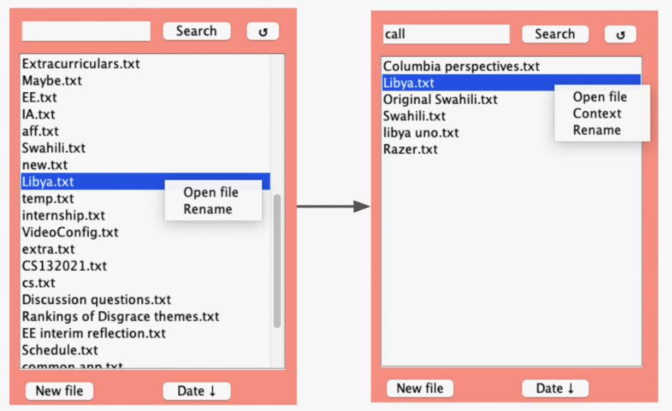
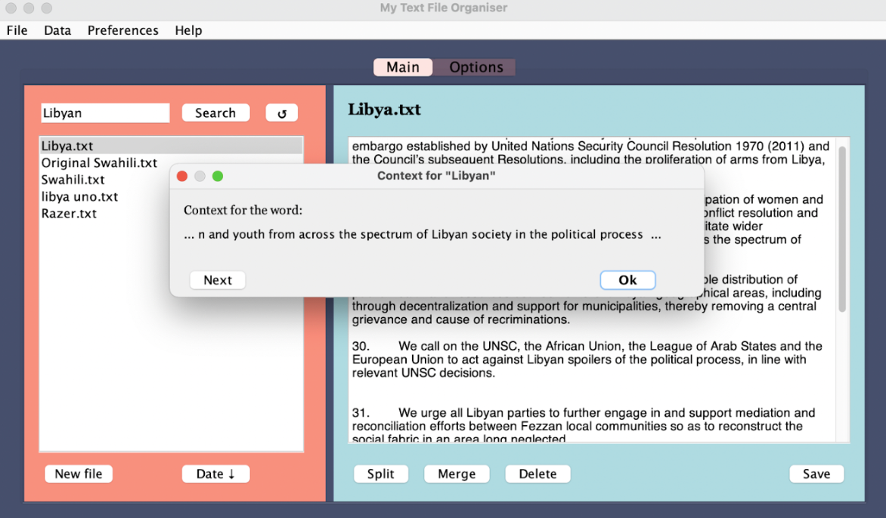
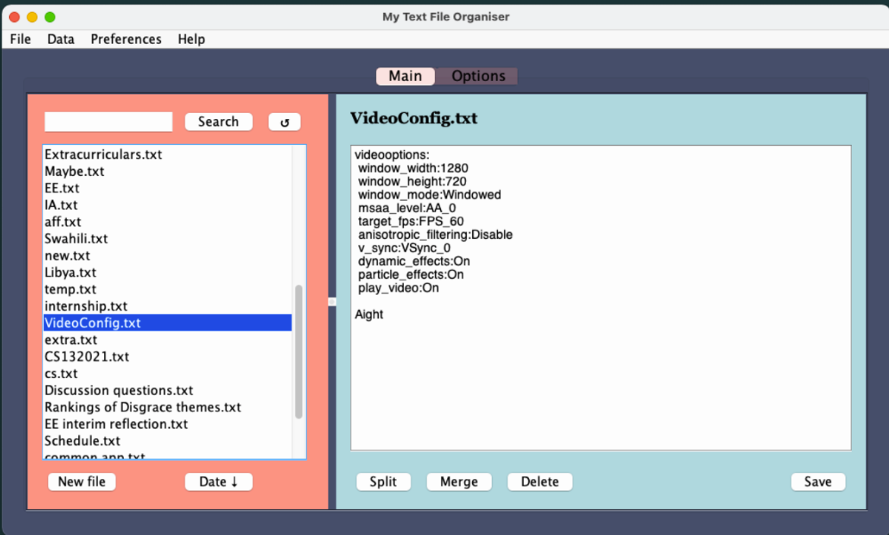
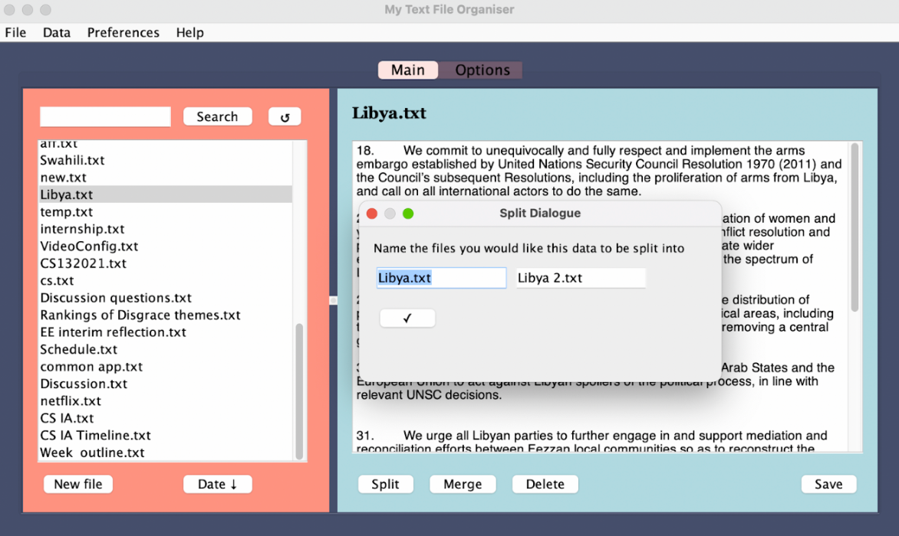
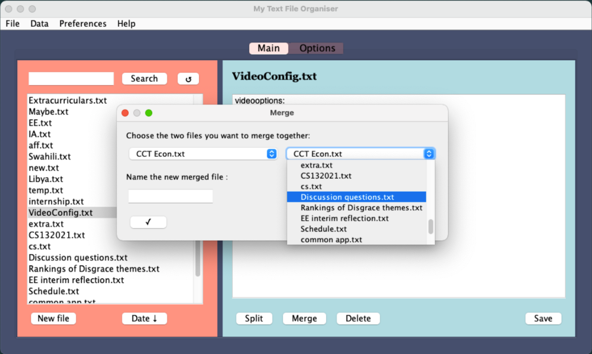

# Struo: A Text File Management System

Struo is for people who love the convenience of text files, but don't like the hassle that comes with them.

It's a dedicated text file management system crafted to efficiently and easily hand collections of text files. It acts as an interface for regular .txt files, providing functionality while not limiting your usage of the files at all. The key idea behind Struo is that it adapts to the way you want to use your computer rather than you adapting to a conventional notetaking app.

It's a full stack app built primarily using Sqlite, Java, and a Swing library called MigLayout.

## Video Introduction

## Inspiration

The idea for Struo came from both my personal and a client's experiences. I am really disorganized and regularly jot stuff down in random .txt files, especially for things like quick note-taking during debates, or daily to-do lists. So, I really wanted a reliable system that allowed me to access those files in a more convenient way without limiting me to some proprietary and limited way of interacting with those files. An acquaintance shared a similar problem, facing difficulties in accessing and managing a vast array of files efficiently. These shared challenges laid the foundation for the conceptualization and eventual realization of Struo.

## Features

- **Databases**: Struo sets up a local lightweight sqlite database for each folder you access through it. This db indexes words/data only for the .txt files in its directory and it is updated and checked for consistency each time you interact with that specific directory through Struo. As such, the data is stored in a decentralized and adaptable way. There are also options for the database to ignore certain words or types of data for privacy/security.

- **Search and Sort**: Struo's search functionality allows users to swiftly sort, filter, and locate their files. 

  
   
  <em>Searching</em>

- **Context**: This feature provides contextual snippets from text files, ensuring users find exactly what they are looking for without needing to actively open and find the relevant information in each search query.

  
   
  <em>Providing Context for a Search Result</em>

- **Open/Edit Files**: Struo lets you open and edit text files-- ensuring that their data remains up-to-date. Quite importantly, you can edit these files with Struo or directly through a notepad and Struo will adapt to your changes.

  
   
  <em>UI for Editing a File</em>

- **Split + Merge**: Struo provides some additional functionality such as easy splitting and merging of text files. This facilitates the management and organization of larger data sets within the text files.

  
   
  <em>Splitting a File</em>

  
   
  <em>Merging two Files</em>

... and more!
